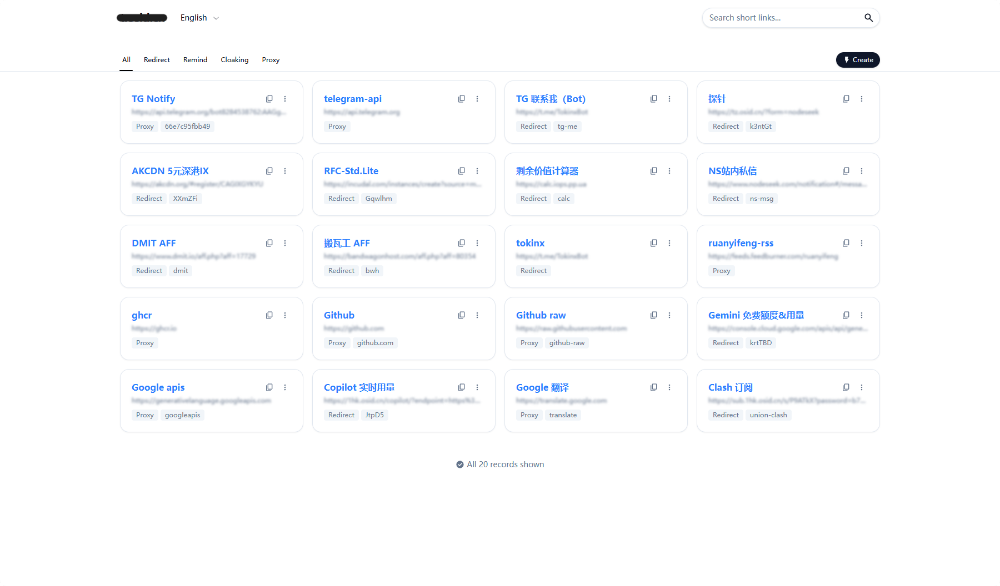
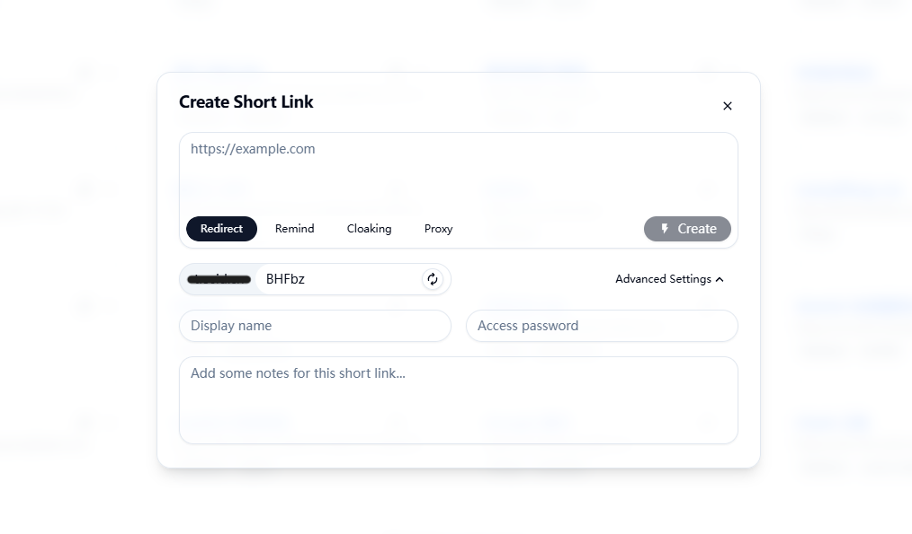
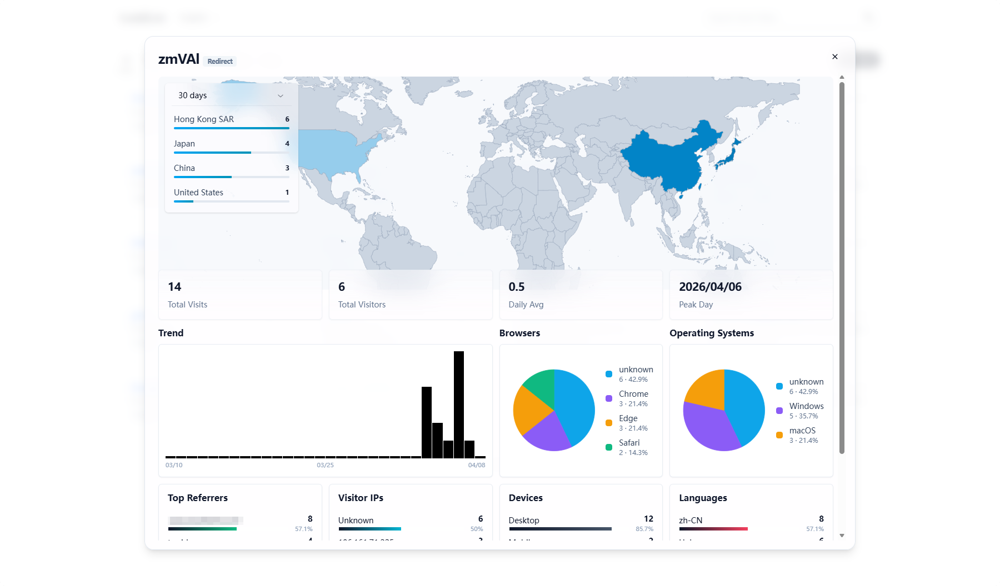

# Fig

基于 Vue 3、Vite 和 Cloudflare Workers 的短链接服务。

## 技术栈

- 前端：Vue 3、Vite、Tailwind CSS、Vue Router、Vue I18n
- 后端：Cloudflare Workers、Hono、D1
- 工具链：Wrangler、Bun

## 部署

### 一键部署：

[](https://deploy.workers.cloudflare.com/?url=https://github.com/Tokinx/Fig)

### 手动部署：

- 克隆项目到本地，修改 `wrangler.jsonc` 和 `.dev.vars`
- `npm run deploy` 上传 Worker 代码和静态资源

## 界面预览
|               首页                |                创建                 |                  分析                  |
| :-------------------------------: | :---------------------------------: | :------------------------------------: |
|  |  |  |

## 路由说明

- `/api/*`：后端 API
- `/`：登录页
- `/manage`：管理后台
- `/:slug` 与 `/:slug/*`：短链接访问与代理访问

## 常用命令

```bash
bun install
bun run dev:web      # 前端开发服务器，默认 http://127.0.0.1:5173
bun run dev:worker   # Worker 开发服务器
bun run dev          # 同时启动前端和 Worker
bun run build        # 构建前端到 dist/
bun run preview      # 预览前端构建结果
bun run deploy       # 构建并部署到 Cloudflare Workers
```

# 项目结构：

```text
Fig/
├─ src/
│  ├─ workers/              # Cloudflare Worker 与 API
│  ├─ web/                  # Vue 前端源码
│  └─ env.d.ts
├─ public/                  # 前端公共静态资源
├─ dist/                    # 前端构建产物（构建后生成）
├─ package.json
├─ vite.config.ts
├─ wrangler.jsonc
├─ jsconfig.json
└─ README.md
```

## 本地开发

1. 安装依赖：

```bash
bun install
```

2. 复制本地 secret 模板：

```bash
cp .dev.vars.example .dev.vars
```

3. 配置根目录 `wrangler.local.jsonc`：

```jsonc
{
  "name": "fig-dev",
  "main": "src/workers/worker.js",
  "vars": {
    "FRONTEND_DEV_SERVER_URL": "http://127.0.0.1:5173",
    "SLUG_LENGTH": 5,
  },
  "d1_databases": [
    {
      "binding": "SQLITE",
      "database_name": "slug-dev",
      "database_id": "your-dev-database-id",
    },
  ],
}
```

4. 在 `.dev.vars` 中填写本地敏感变量：

```env
PASSWORD=dev-password-change-me
CF_API_TOKEN=your-cloudflare-api-token
CF_ACCOUNT_ID=your-cloudflare-account-id
```

5. 分别启动前端和 Worker：

```bash
bun run dev:web
bun run dev:worker
```

默认情况下：

- 前端开发服务器：`http://127.0.0.1:5173`
- Worker 开发服务器：`http://127.0.0.1:8787`
- `.dev.vars` 只用于本地开发，不要提交到仓库
